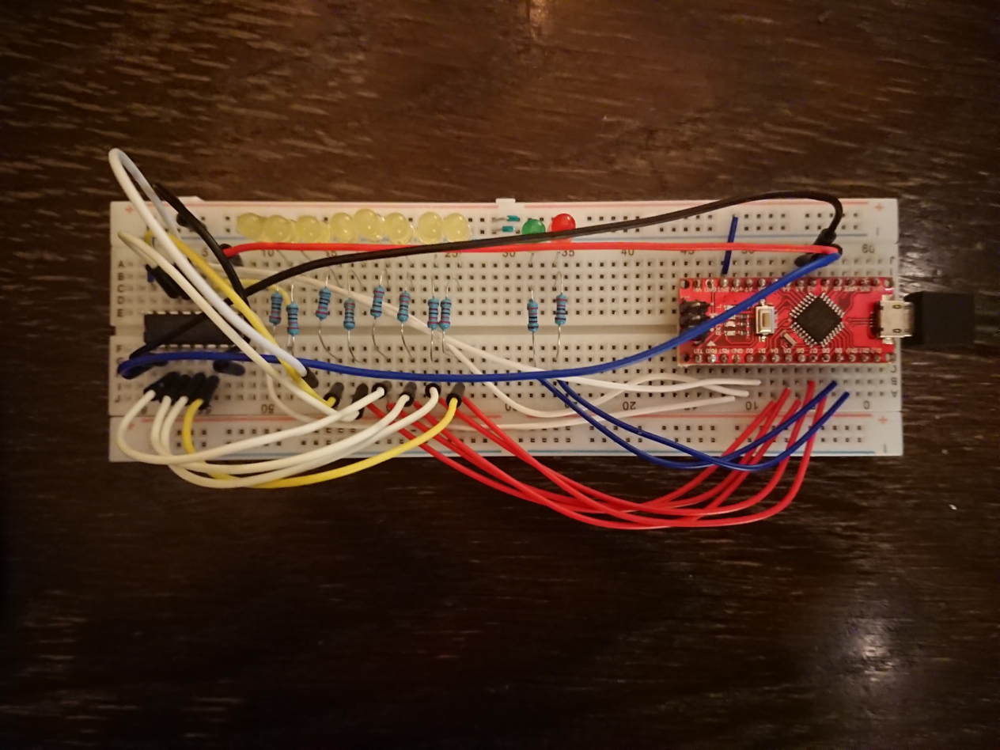

Shift Register Tester
=====================

This is a simple Arduino project to automate testing of 74xx shift
registers (well, apart from plugging in and out the actual chip)

For starters, it will only handle 74x165 (x being empty, LS, HC, HCT,
as long as it works with Arduino style logic levels it'll be ok).
It is not supposed to be a speed demon, but will allow to test
the chip with arbitrary patterns as fast as it will take it, and
as fast as the Arduino can receive it (the 165 is a parallel-to-serial
shift register, so receiving is what takes most of the time).

Given that the human eye isn't that quick in seeing LEDs blink,
I added a delay after the check.

Hardware needed: Arduino nano (but you can use about any Arduino
for this), I even use the (older) ATmega168-based Arduino. The
program is so simple and short it should even be possible to
implement it on a PIC or some other microcontroller, but we need
ten outputs and three inputs, so there's that.

Organization:
hw is where the hardware is described, for KiCAD
src is where the Arduino source code is located
pics has some pictures of my (experimental) build

> 

The yellow LEDs are just to help me debugging, they're not
essential to the build, because you normally only want to know
if your shift registers are good or blown.

You may want to realize this on a protoboard, with a ZIF socket,
then again you may not (how many 74165s do you really have?).
For me the breadboard build is more than enough.

Future expansion: make it work for 74595s (serial in, parallel out).

License is GPL
